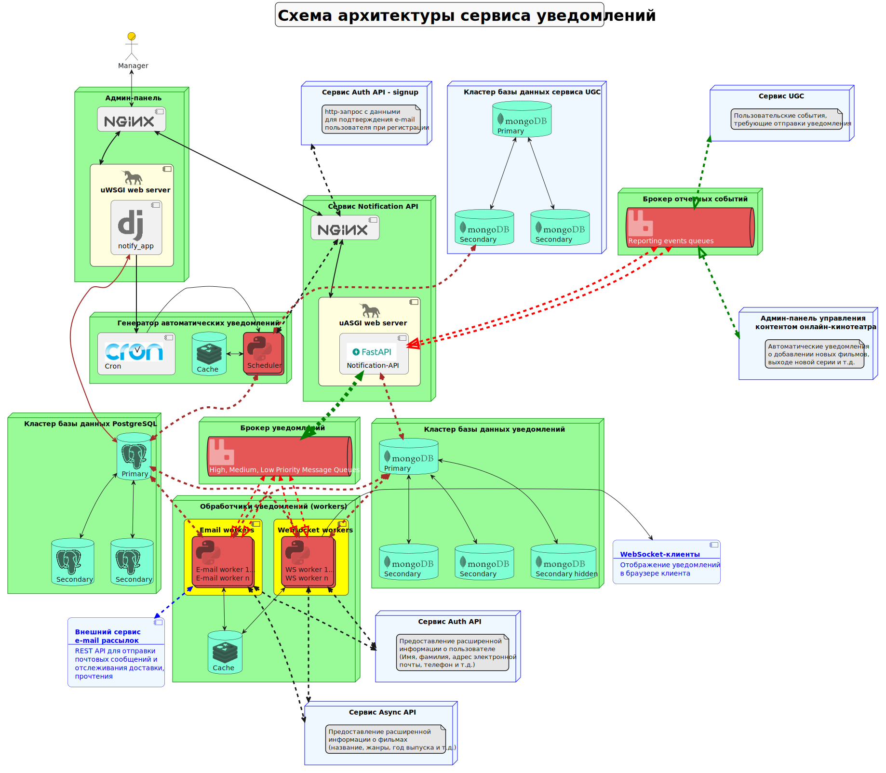

## Проектная работа 10 спринта команды

### Схема архитектуры сервисов


### Запуск сервисов

1. Запустить docker-compose в корневом каталоге проекта командой:
```shell
docker-compose up --build -d
```
2. Подключиться к postgresql командой:
```shell
docker exec -it notify_db psql -U django_user -t notification_database
```
3. Создать схему `notification` командой:
```postgresql
CREATE SCHEMA notification;
```
4. Отключиться от postgresql - `exit`
7. Выполнить миграции django:
```shell
docker exec -it notification_admin python manage.py migrate
```
8. Создать суперпользователя для подключения к админке django
```shell
docker exec -it notification_admin python manage.py createsuperuser
```
9. Заполнить бд админ панели данными. Для этого выполнить скрипт:
```shell
docker exec -it notification_admin python manage.py loaddata fixtures/admin_notification_data.json
```
10. Обновить состояние базы данных AuthAPI до последней миграции. 
```shell
docker exec -it auth_api flask db upgrade
```
11. Создать суперпользователя для AuthAPI
```shell
docker exec -it auth_api flask createsuperuser
```
12. При необходимости через Swagger-документацию AuthAPI или Postman добавить пользователей, дополнительные роли и 
назначить эти роли пользователям. При добавлении каждого нового пользователя в Notification API направляется HTTP-запрос
с данными для создания создания письма для подтверждения E-mail.

### Адреса для доступа к сервисам

**Админка доступна по адресу:** 
```http request
http://127.0.0.11:8888/admin
```
**Swagger-документация Notification API доступна по адресам:**
```http request
http://127.0.0.11:8888/api/openapi
```
или
```http request
http://127.0.0.1:8080/api/openapi
```
**Web-интрефейс RabbitMQ Management доступен по адресу:**
```http request
http://127.0.0.1:15672/
```
имя пользователя - `rabbit`
пароль - `rabbit_password`

**Swagger-документация AuthAPI доступна по адресу:**
```http request
http://127.0.0.1:8088
```


