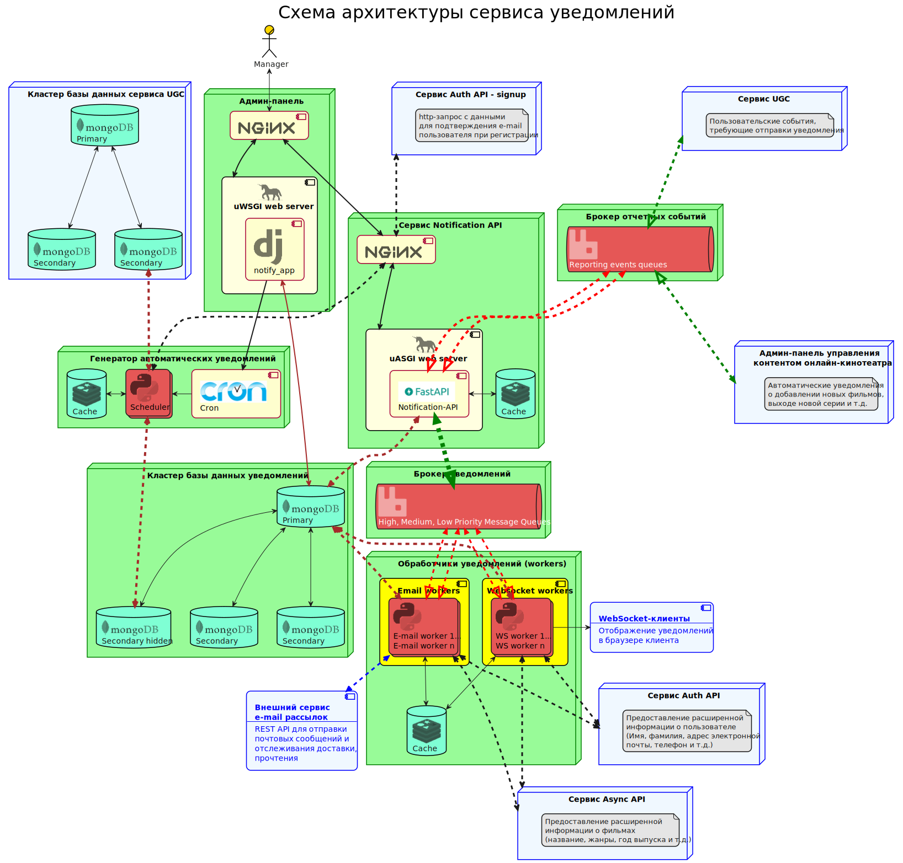

## Проектная работа 10 спринта команды

### Схема архитектуры сервисов


### Запуск сервисов

1. Запустить docker-compose в корневом каталоге проекта командой:
```shell
docker-compose up --build -d
```
2. Подключиться к postgresql командой:
```shell
docker exec -it notify_db psql -U django_user -t notification_database
```
3. Создать схему `notification` командой:
```postgresql
CREATE SCHEMA notification;
```
4. Отключиться от postgresql - `exit`
7. Выполнить миграции django:
```shell
docker exec -it notification_admin python manage.py migrate
```
8. Создать суперпользователя для подключения к админке django
```shell
docker exec -it notification_admin python manage.py createsuperuser
```
9. Заполнить бд данными. Для этого выполнить скрипт:
```shell
docker exec -it notification_admin python manage.py loaddata fixtures/admin_notification_data.json
```
10. Админка доступна по адресу: 
```http request
http://127.0.0.11:8888/admin
```
11. Swagger-документация Notification API доступна по адресам:
```http request
http://127.0.0.11:8888/api/openapi
```
или
```http request
http://127.0.0.1:8080/api/openapi
```
12. Web-интрефейс RabbitMQ Management доступен по адресу:
```http request
http://127.0.0.1:15672/
```
имя пользователя - `rabbit`
пароль - `rabbit_password`


